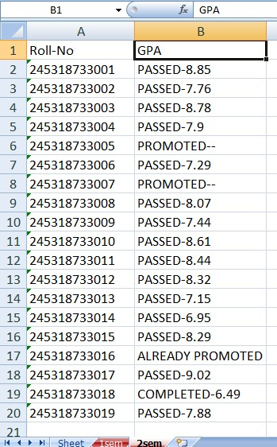
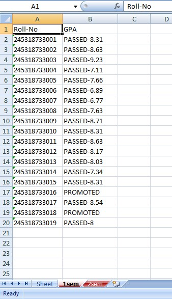

# Result Scraping Using Python 


## Overview
It is an amateur project developed by me by collaborating the use of two popular libraries of python, ***Selenium*** and ***openpyxl*** while learning about them


## Algorithm 
1. I opened a workbook using ```Openpyxl``` library
2. I, then also imported ```Selenium``` library for automating my results' website using **chromedriver**
3. I created a function ```result_in_excel``` which takes two parameters, one is the title_name(name of the excel sheet) and other one, website(it is the link of the website)
4. Here, I **scraped the GPA of nineteen students as example** by taking a loop between integers 1 to 20.
5. In the loop, I initiated the driver using ```Selenium``` and went into the website which is given as a parameter.I have found the search bar of the website using ```find_element_by_name``` function and automated it. I scraped the web table's information and stored in the excel sheet which is the output of the program.


## Demo Output


